# CIS 4360 Lab 1 Report
### Course: CIS 4360 - Microservice Architecture
### Section #: 003
### Student Name: Remi Adewale

#### Note: I did not have to run the code below to enable the Artifact Registry.

```
gcloud services enable containerregistry.googleapis.com
gcloud services list --enabled | grep containerregistry.googleapis.com
```

### Skip "Start Lab" to continue to Task 1

## Task Screenshots

### Task 1
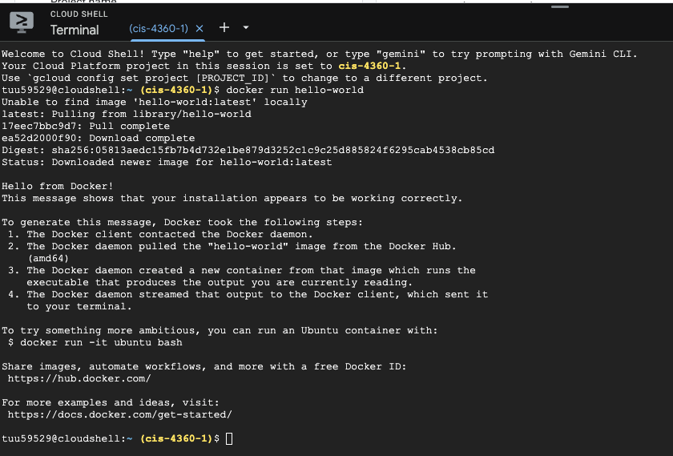

#### 1.2
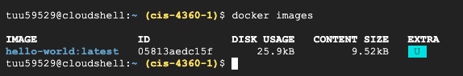

### 1.3
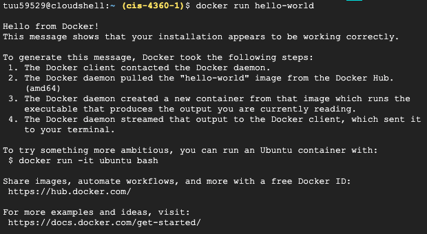

### Task 1.4
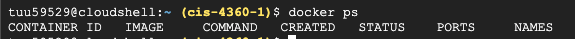
### Task 1.5
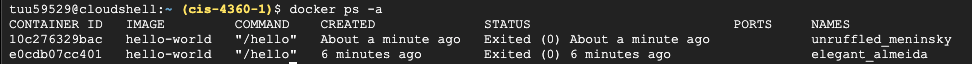

### Task 2
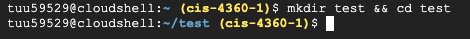

#### 2.2
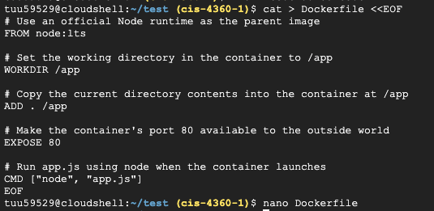

#### 2.3
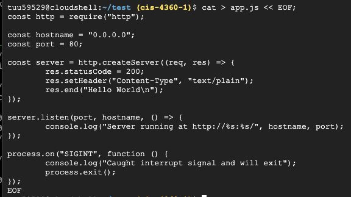

#### 2.4
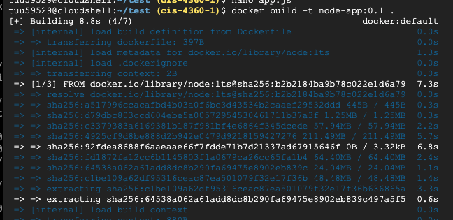

#### 2.5
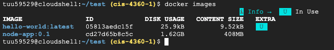

### Task 3
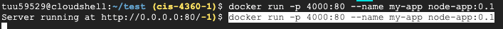

#### 3.2
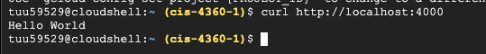

#### 3.3
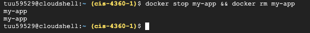

#### 3.4
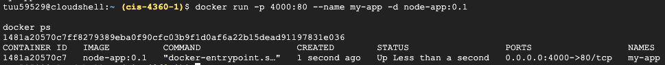

#### 3.5
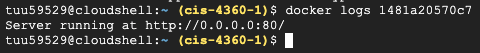

#### 3.5.1
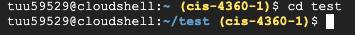

#### 3.5.2
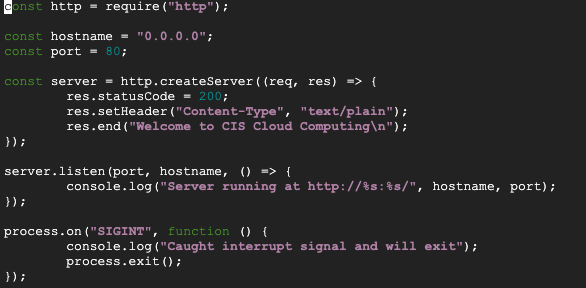

#### 3.5.3
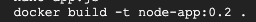

#### 3.5.4
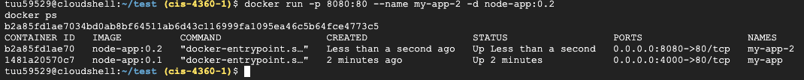

#### 3.5.5
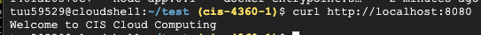

#### 3.6
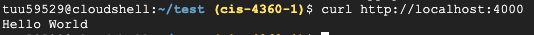

### Task 4
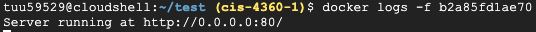

#### 4.2, 4.3, 4.4
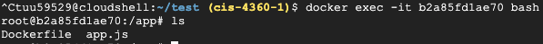

#### 4.5
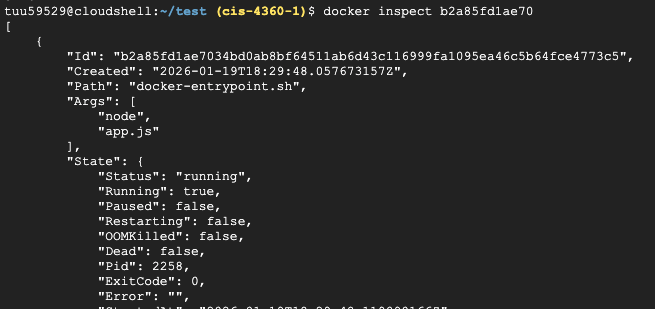

#### 4.6
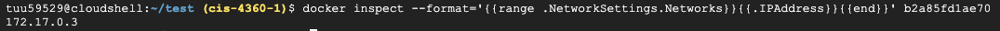


### Task 5
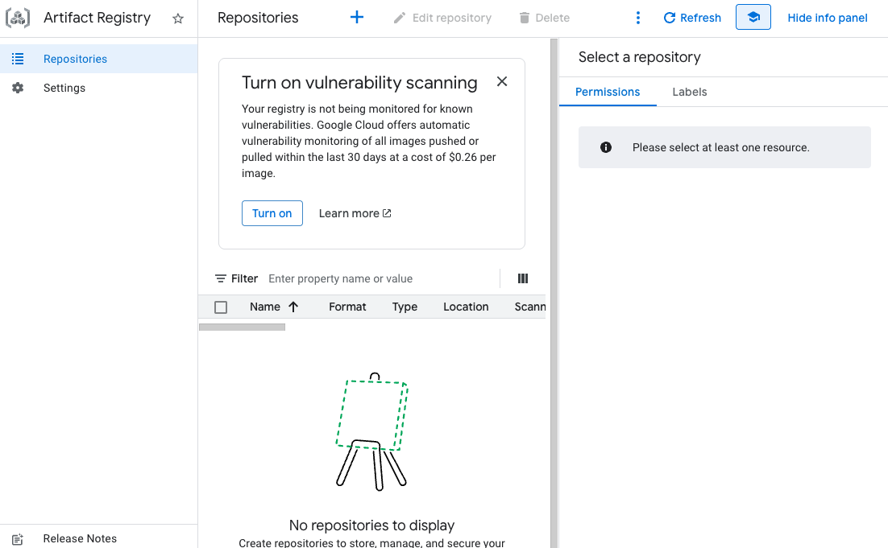

#### 5.x
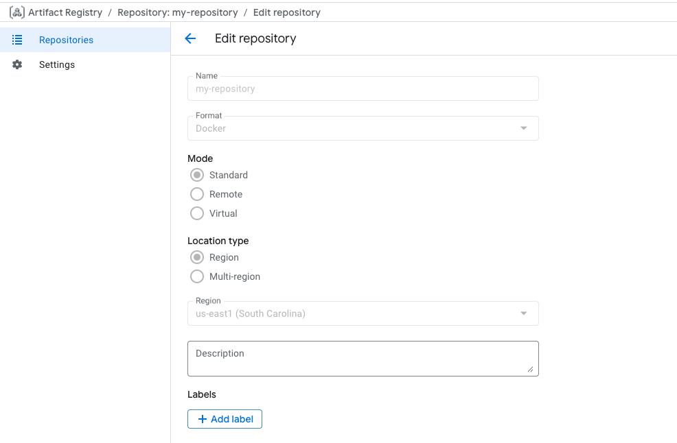


### Gcloud Auth
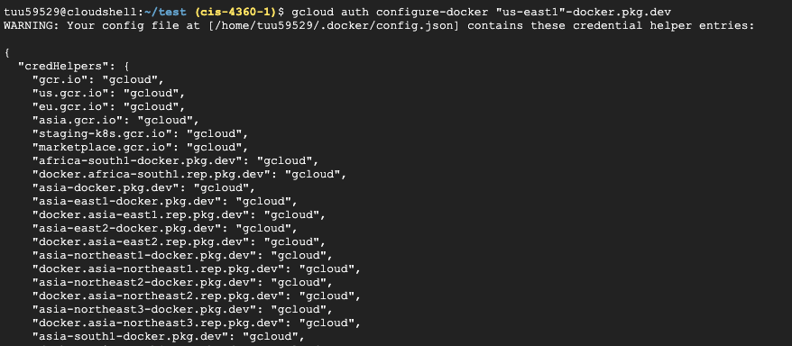
-
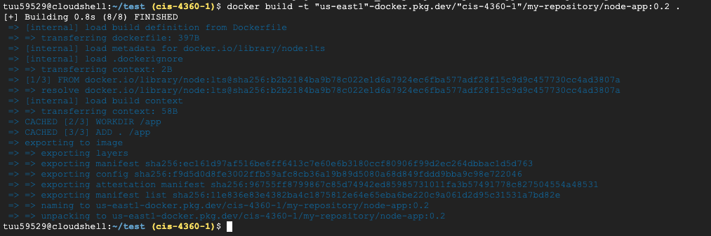
-
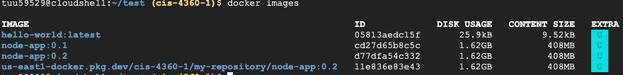
-
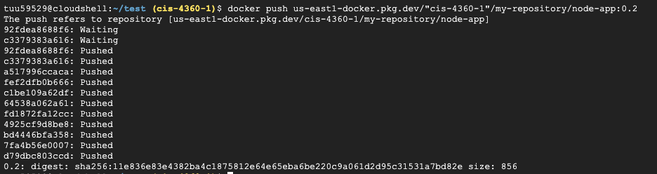
-
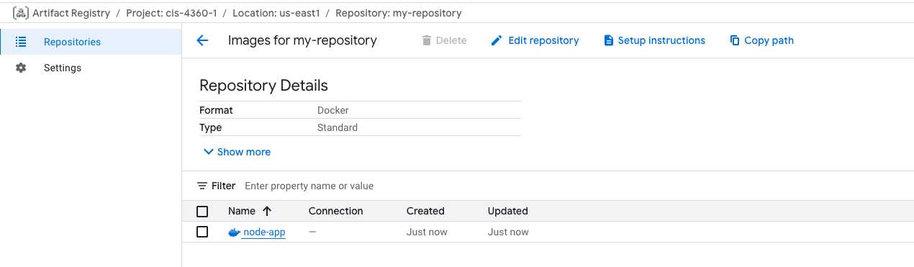


### Testing the Image
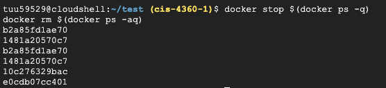
-
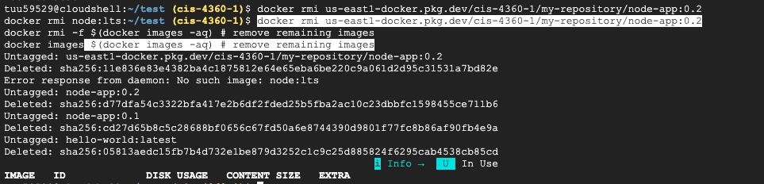
-
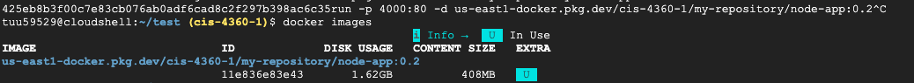
-
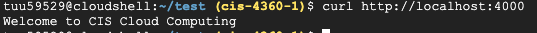
-